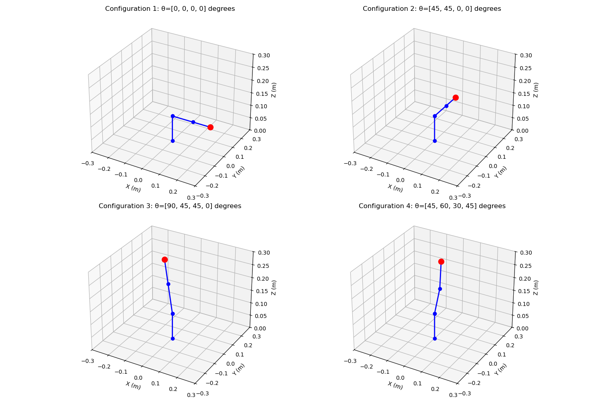
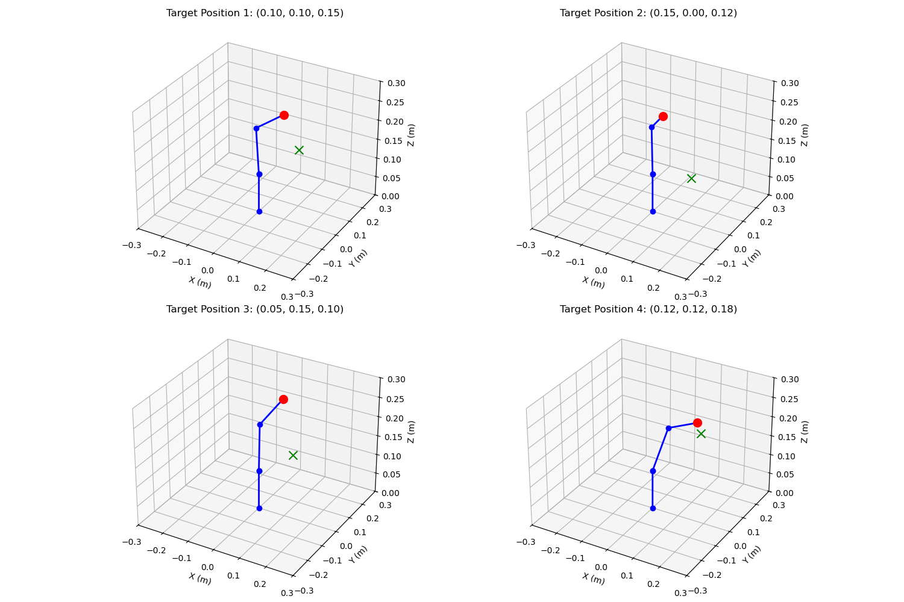
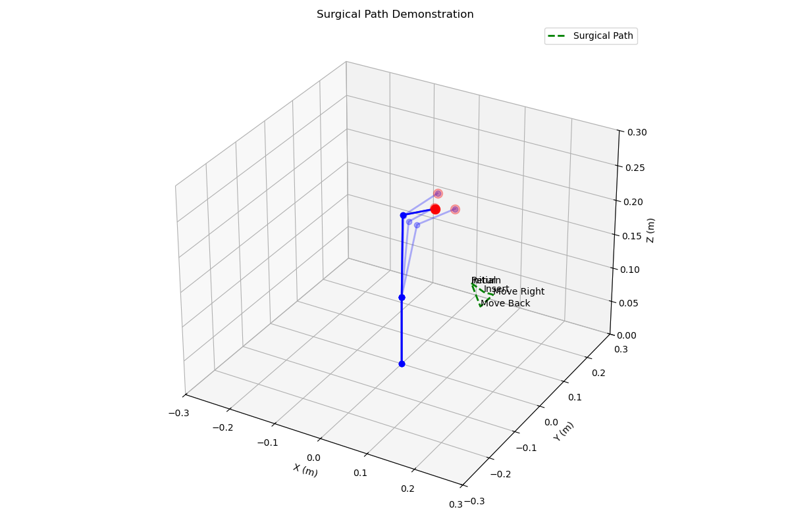

# 4-DOF Robotic Arm Simulation for Minimally Invasive Surgery

  
*Example configurations of the 4-DOF robotic arm*

## 📌 Overview
A Python-based simulation of a 4-degree-of-freedom (DOF) robotic arm designed for surgical applications. Implements forward/inverse kinematics using Denavit-Hartenberg (DH) parameters, with joint constraints and path planning visualized in 3D.

## 🛠 Key Features
- **Forward/Inverse Kinematics**: Precise end-effector control using DH transformation matrices.
- **Joint Limit Constraints**: Realistic mechanical movement boundaries.
- **Surgical Path Planning**: Simulates trajectories for procedures like suturing.
- **Workspace Analysis**: Maps reachable areas to validate target positions.
- **3D Animations**: Interactive visualizations using Matplotlib.

## 📊 Demonstrations

### 1. Forward Kinematics
  
*Arm configurations for varying joint angles.*

### 2. Inverse Kinematics
  
*End-effector reaching target positions (green crosses).*

### 3. Surgical Path Tracking
  
*Simulated suturing path with waypoints (insertion, movement, return).*

### 4. Homogeneous Transformations
```python
# Example transformation matrix for Joint 1:
T = [
    [cos(θ), -sin(θ), 0, a*cos(θ)],
    [sin(θ),  cos(θ), 0, a*sin(θ)],
    [0,       0,      1, d       ],
    [0,       0,      0, 1       ]
]
